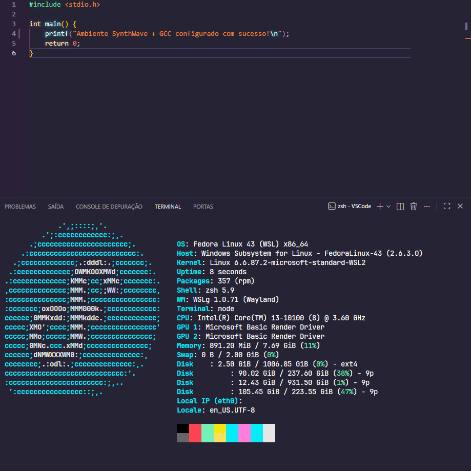

# 💻 ADS — Workspace & VS Code Setup



> Ambiente de desenvolvimento em execução — VS Code + WSL2 + SynthWave '84

---

## 📌 Sobre o Projeto

Ambiente de desenvolvimento estruturado para a graduação em **Análise e Desenvolvimento de Sistemas (ADS)**.

Todo o código reside fisicamente no filesystem do **Fedora Linux 43 (WSL2)**, garantindo velocidades de compilação nativas. A interface é renderizada pelo **VS Code no Windows** via extensão WSL — eliminando os gargalos de I/O do NTFS sem abrir mão do ambiente gráfico do Windows.

---

## ⚙️ Stack

| Ferramenta | Função |
|---|---|
| VS Code + WSL Extension | Editor integrado ao Linux |
| Fedora Linux 43 (WSL2) | Filesystem e compilação |
| GCC | Compilador C/C++ |
| SynthWave '84 + Custom CSS | Tema com efeito neon/glow |
| Starship | Prompt do terminal integrado |

---

## 📁 Estrutura do Diretório

```text
VSCode/  (/home/kadota/VSCode)
├── .vscode/
│   ├── launch.json       ← Configurações de debug
│   └── tasks.json        ← Tasks de compilação (GCC)
├── Algoritmos/           ← Disciplina: Algoritmos
├── Lógica de Programação/ ← Disciplina: Lógica de Programação
├── IMG/
│   └── VSCode.png
├── .gitignore
└── README.md
```

---

## 🔄 Restauro Pós-Formato

### 1 — Clonar o repo
```bash
git clone https://github.com/matheuskadota/ADS_VSCode-Setup /home/kadota/VSCode
```

### 2 — Abrir no VS Code
```bash
code /home/kadota/VSCode
```

### 3 — Extensões WSL necessárias
Instalar no VS Code após abrir o workspace:

- C/C++ (Microsoft)
- C/C++ Extension Pack
- CMake Tools
- Code Runner
- Error Lens
- SynthWave '84
- Custom CSS and JS Loader

### 4 — Reativar o glow do SynthWave
Após instalar as extensões:
1. `Ctrl+Shift+P` → `SynthWave '84: Enable Neon Dreams`
2. `Ctrl+Shift+P` → `Enable Custom CSS and JS`
3. Reiniciar o VS Code como administrador

---

## 📝 Convenção de Nomes

Cada disciplina organiza seus arquivos por aula:

```text
Algoritmos/
├── Aula01_variaveis.c
├── Aula02_condicionais.c
└── Aula03_loops.c
```
